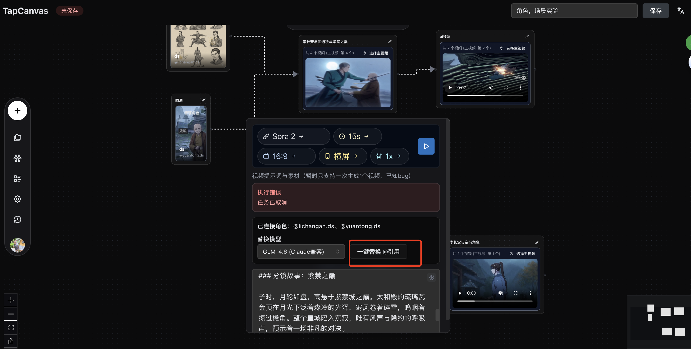
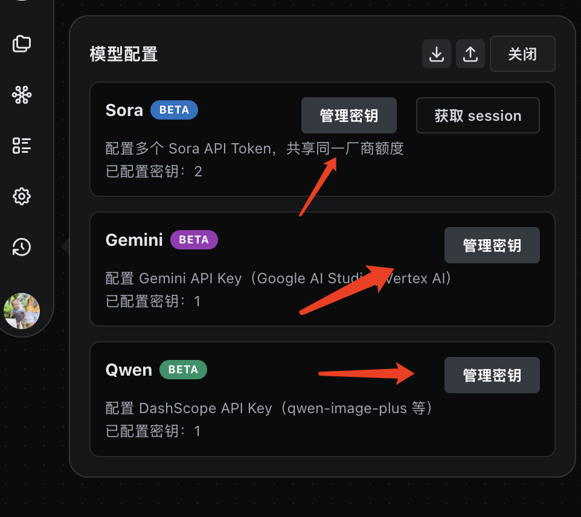
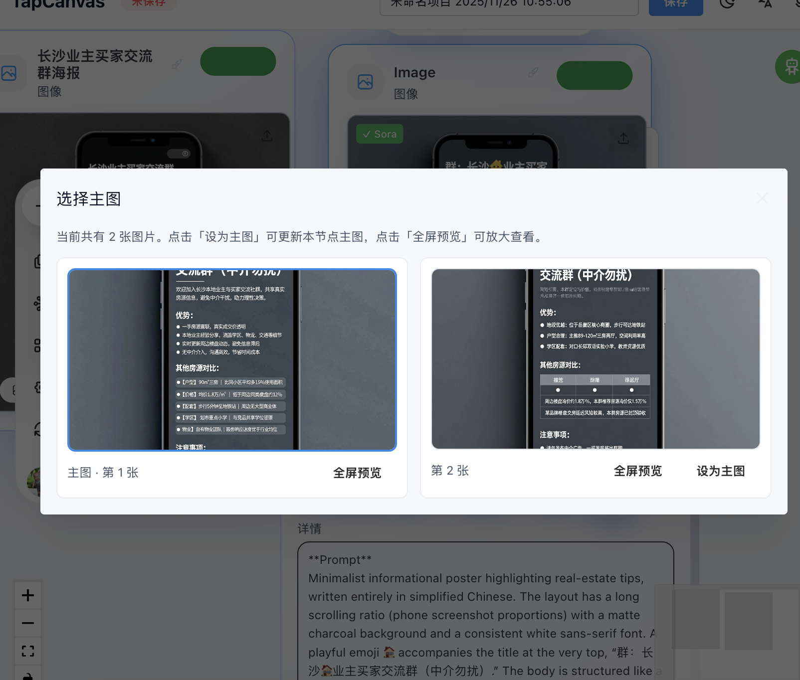
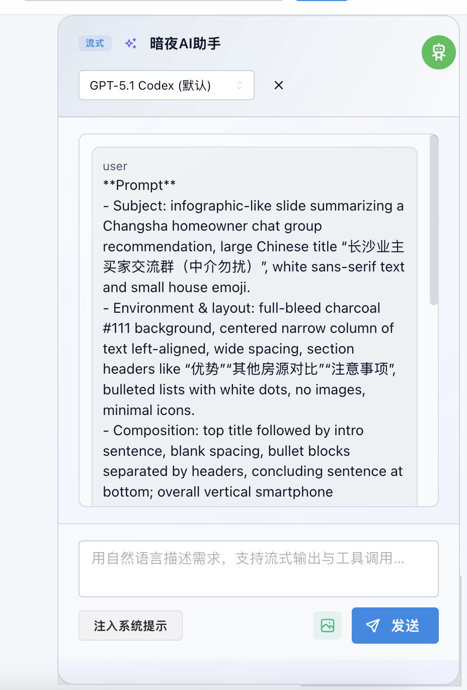
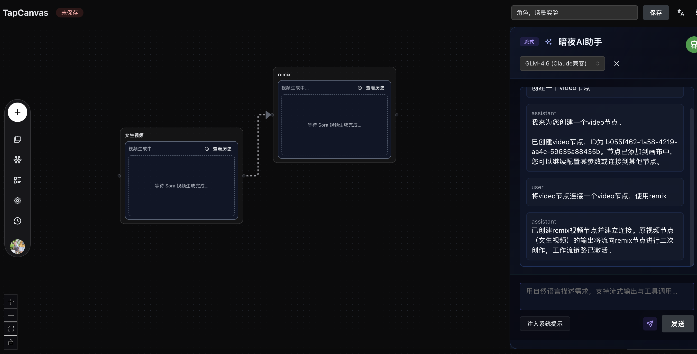
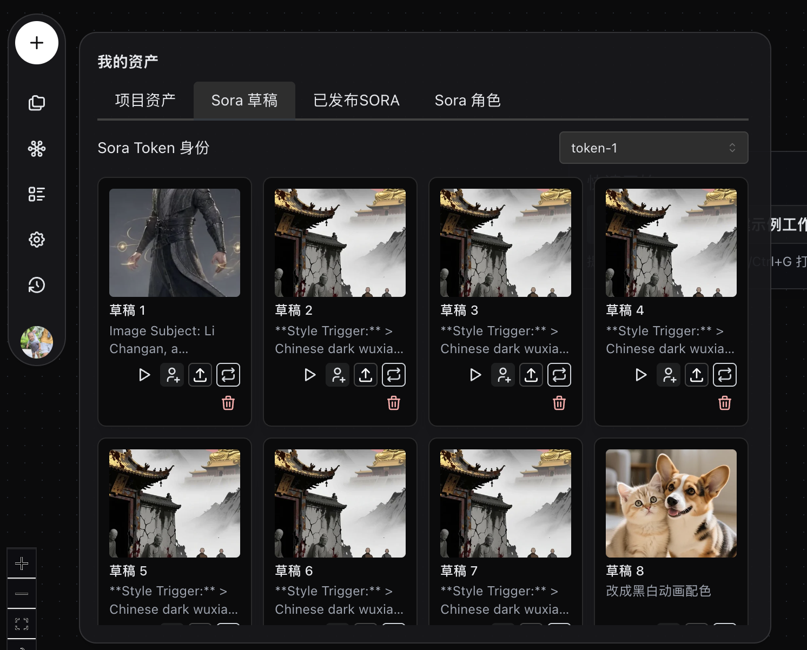
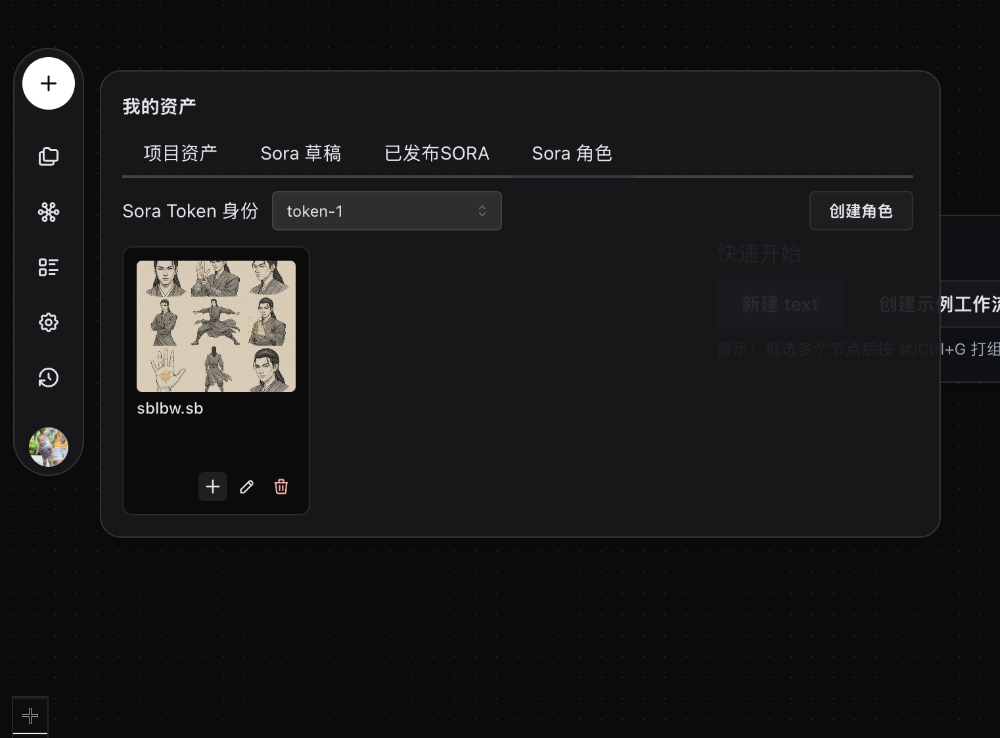
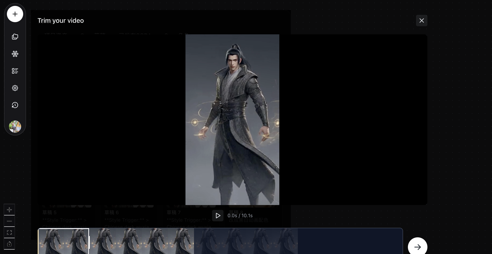
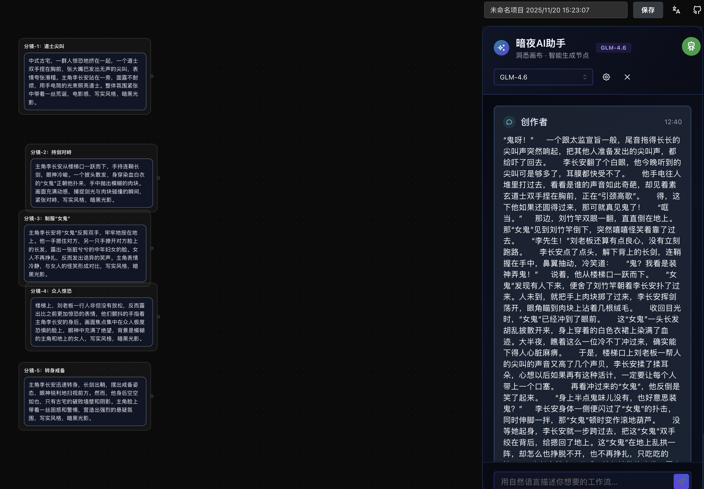

<!-- Split from root README.md; full Chinese doc lives here. -->
<p align="center">
  
</p>

<h1 align="center">TapCanvas</h1>
<p align="center">
  <a href="../LICENSE">
    
  </a>
  <a href="https://github.com/anymouschina/TapCanvas">
    
  </a>
</p>

<p align="center">一款零 GPU 的可视化 AI 内容创作平台：聚合多模型能力，在同一画布内完成文本→图像→视频等完整创作工作流。</p>

**Language:** 中文 | [English](../README_EN.md)

**可视化 AI 创作画布（零 GPU）**

源码分析：[deepwiki](https://deepwiki.com/anymouschina/TapCanvas)

## 📝 简介

TapCanvas 是一款聚合多模型的可视化 AI 内容创作平台：将不同厂商、不同类型的模型能力（文本、图像、视频等）统一到同一画布与资产体系中，通过可编排的节点工作流完成从灵感、分镜、素材到成片的全流程生产；支持 Remix 链式调用、多账号协作与项目化沉淀。但我们的能力远不止于此：

[📘 使用指引（飞书文档）](https://jpcpk71wr7.feishu.cn/wiki/WPDAw408jiQlOxki5seccaLdn9b)

### ✨ 最新能力速览

- **全新暗夜设计语言**：UI 基于 Mantine 与 React Flow 重新梳理，顶部信息条、右侧面板与 Storyboard/资产面板能够在同一画布内无刷新切换，聚焦模式和组管理让复杂节点也能在统一视觉体系下保持清晰。
- **Nano Banana 三档模型**：默认图像节点已经接入 Nano Banana / Fast / Pro 模型，并默认使用 Nano Banana Pro，可通过同一个表单拖拽提示词、参考图或整段剧情，直接生成分镜垫图、角色定妆照与高质量文生图/图生图结果。
- **Sora 2 + Veo 3.1 双引擎**：视频节点即插即用 Sora 2 与 Veo3.1 Fast/Pro，支持 Remix、参考第一帧/最后一帧、复用 Storyboard 片段，让多镜头视频在画布内一气呵成。
- **图生图链路**：图像节点支持上传参考图、抽帧、资产拖拽，任何生成的图片都可以作为下一次调用的输入，实现文本→图像→图像（图生图）→视频的完整闭环。
- **GRSAI 中转站适配**：内置 grsai 代理配置面板，可以一次性填入 Host 与 API Key，同步展示积分与可用模型状态，将 Nano Banana、Sora 2、Veo 3 等请求稳定转发到海外节点或国内直连。

**🎨 创新的可视化工作流**

- 首创将复杂AI创作流程转化为直观的节点连线操作
- 支持文生图→图生视频→视频合成的完整创作链路
- 智能类型匹配系统，自动防止错误连接，让创作更可靠

**⚡ 强大的画布交互体验**

- 基于React Flow的高性能渲染，支持复杂工作流流畅操作
- 独有的组聚焦模式，让大型项目也能清晰管理
- 智能辅助连接，从文本/图片节点拖拽即可快速创建下一环节

**🧠 智能化创作辅助**

- 集成Gemini 2.5进行提示词优化和智能建议
- 支持历史提示词复用，避免重复思考
- Sora2角色@提及功能，精准控制视频角色

**🔧 企业级工程能力**

- 零GPU要求，全部计算依赖云端API，轻量化部署
- 模块化架构设计，易于扩展新的AI模型和功能
- 完整的项目管理和资产治理体系

通过可视化工作流的方式，我们不仅降低了AI视频创作的门槛，更为创作者提供了一个专业、高效的创作平台。

## 🖼️ 功能预览


TapCanvas 的可视化画布界面展示了强大的 AI 创作工作流能力：从文本提示词开始，通过智能连接生成图像和视频内容，实现完整的创意到作品的转化过程。

### 🤖 自动角色引用（Auto Role Mentions）



- 在同一个工作流中连接角色节点后，视频/文本节点可一键触发「自动替换人物名称」，由 LLM 将脚本中的角色名称统一替换成角色卡的 `@username`，并保证前后各留出一个空格，避免与其他字符粘连。
- 支持批量处理全部入边角色，模型可选 Gemini / GLM，完成后会将结果同步到 Sora 提示词，确保多镜头引用一致。
- 如果脚本中缺少某个角色，也会自动补充一次 `@username`，避免 Sora 任务因 cameo 缺失而失败。

### 🎬 Storyboard（镜头拆解）工作流

Sora 2 新增的故事板模式，把整个短片拆成一格格镜头，每格都写清楚镜头时长、构图、动作、台词、镜头移动与提示词，适合逐镜生成后再剪辑合成。推荐流程：

1. **定目标时长**：Sora 2 单镜头通常 10s 左右，可根据需要拆成 2-4 镜。
2. **拆镜**：为每一镜写序号/时长/镜头类型（近景/中景/远景）/动作/情绪/转场等关键信息。
3. **独立提示词**：每镜提示词前置风格（例如 `2d日本动漫`），并支持引用角色节点 `@heng`、`@keng`；如需真人 cameo，可在网页上传角色卡或照片。
4. **注意 Sora 限制**：App 版一次只生成 10s，横竖屏不可选、额度约 30 次/天；上传角色若失败，可更换梯子或改为素描风避免版权审查。
5. **产出与微调**：导出后在本地剪辑，也可发布到 Sora 后用 remix 做细调。

简短示例：

- 镜 1：0-2s 近景，主角惊讶（提示词：`2d日本动漫`，`@heng` 特写，面部光影，慢推近）
- 镜 2：2-7s 中景，两人对话（提示词：`@heng` 与 `@keng` 在咖啡店交谈，温暖灯光）
- 镜 3：7-10s 拉远收束（提示词：广角，夕阳，电影感）

#### Storyboard 使用截图

| 规划镜头列表                                       | Scene 详情浮层                                       | 运行日志与结果                                               |
| -------------------------------------------------- | ---------------------------------------------------- | ------------------------------------------------------------ |
|  |  |  |

### 🎥 AI 视频真实感九大法则

为了让 Sora / Runway / Pika 等节点生成更贴近实拍的镜头，我们整理了「光影统一逻辑、手持抖动、景深与对焦、光学瑕疵、微动作链、材质细节、环境动力、摄影机意图、微剧情与瑕疵保留」九大原则，全部嵌入 Storyboard、Prompt 资产与 AI 助手知识库的推荐流程里。规划镜头或撰写提示词时，可直接对照这些检查项，确保多镜头链路在光影、风向、材质与镜头语言上保持一致，输出真实的纪录感质感。

- 关键参数包含：手持微抖幅度 0.8%–1.2%、拉焦时间 2s、暗角 5%–8%、风向延迟链、35/50mm 焦段等。
- 每条原则都附 TapCanvas 的落地建议（如何写入 Storyboard/节点参数/合成模板）。
- 可以把指南加入 AI 助手知识库，让助手在生成 Prompt 时自动补全真实感字段。

👉 [查看完整《AI 视频真实感指南》](AI_VIDEO_REALISM_GUIDE.md)

### 🔁 图生图与帧参考

- **参考图上传 & 反推**：图像节点内建 `imageUpload` 能力，可直接拖拽本地素材、Sora 抽帧或资产库图片，作为 Nano Banana/Qwen 等模型的图生图参考；还支持一键反推当前图片的提示词，方便继续沿用。
- **多帧串联至视频**：任意图像节点输出都能直接连接 Sora 2 或 Veo 3.1 节点，形成「文生图 → 图生图 → 图生视频」链路；Veo 节点额外支持第一帧、最后一帧和多张参考图配置，确保构图与角色在每一镜保持一致。
- **素材资产流转**：资产面板、模板面板、AI 助手回传结果都可以拖到画布，快速创建含参考图的新节点，实现跨项目的图生图复现。

## ⚙️ 使用前配置模型

**重要：在使用 TapCanvas 之前，务必先配置 AI 模型！**



### 模型功能对应关系

不同 AI 模型支持不同的节点类型，请正确配置：

| 节点类型                  | 支持的模型                                                                                                                                                                                                            | 功能说明                                                                                                  |
| ------------------------- | --------------------------------------------------------------------------------------------------------------------------------------------------------------------------------------------------------------------- | --------------------------------------------------------------------------------------------------------- |
| **🎬 Video 节点**   | **Sora 2**, **Veo 3.1 Pro/Fast**, Runway Gen-3, Runway Gen-2, Pika Labs V2, Pika Labs V1.5, HeyGen Video, Synthesia Video, LumaLabs Dream Machine, Kaiber Video, Stable Video Diffusion                   | 图生视频、文生视频、参考帧过渡、视频合成、动画制作                                                        |
| **🖼️ Image 节点** | **Nano Banana / Fast / Pro**, **Qwen Image Plus**, Gemini 2.5 Flash Image, DALL-E 3, DALL-E 2, Stable Diffusion XL, Stable Diffusion V3, Midjourney V6, FLUX.1 Pro, FLUX.1 Dev, Kolors IMG, Hunyuan Image | 文生图、图生图、图像生成、多种分辨率、风格转换，可将长篇小说/剧情拆解为分镜垫图，作为后续视频节点的参考帧 |
| **📝 Text 节点**    | **Gemini 2.5 Flash**, Gemini 2.5 Pro, Gemini 3 Pro Preview, Claude 3.5 Sonnet, Claude 3 Haiku, GPT-4o, GPT-4o Mini, DeepSeek V3, Moonshot V1 8K, Kimi Chat                                                      | 文本生成、提示词优化、智能建议、内容创作                                                                  |

### 配置步骤

1. **打开模型配置面板**：在右侧面板点击"模型配置"
2. **添加提供商**：根据需要添加 Sora、Qwen、Gemini 模型
3. **配置 API 密钥**：填入各平台的真实 API 密钥
4. **测试连接**：确保每个模型都能正常调用

> 💡 **提示**：只有正确配置了模型，对应的节点才能正常工作。例如：
>
> - 想要生成视频？→ 必须配置 **Sora 2**、**Runway** 或 **Pika** 等视频模型
> - 想要生成图片？→ 必须配置 **Qwen**、**DALL-E**、**Stable Diffusion** 或 **FLUX** 等图像模型
> - 想要优化提示词？→ 必须配置 **Gemini**、**Claude**、**GPT** 或 **DeepSeek** 等文本模型

### 🎯 推荐配置组合

**新手推荐配置**：

- 📝 **Text**: Gemini 2.5 Flash（性价比高）
- 🖼️ **Image**: Nano Banana Fast（grsai 中转）或 Qwen Image Plus，兼顾文生图与图生图
- 🎬 **Video**: Sora 2（功能最强，可选 grsai 中转以提高稳定性）

**专业级配置**：

- 📝 **Text**: Gemini 2.5 Pro 或 Claude 3.5 Sonnet
- 🖼️ **Image**: Nano Banana Pro、DALL-E 3 或 Midjourney V6（高细节与一致性）
- 🎬 **Video**: Sora 2 + Veo 3.1 Pro（双引擎，支持参考帧与 Remix），Runway Gen-3 补充风格化视频

## 🚀 快速运行

### 本地开发（推荐）

> 后端为 **NestJS（Node.js）+ Hono（复用路由/OpenAPI）**，本地使用 **SQLite**（默认 `.data/tapcanvas.sqlite`）。

```bash
# 1) 安装依赖
pnpm install

# 2) 配置环境（见下方“环境配置”）
cp apps/web/.env.example apps/web/.env
cp apps/hono-api/.env.example apps/hono-api/.env

# 3) 启动（建议开两个终端）
pnpm dev:web
pnpm dev:api
```

### Docker 一键启动（推荐给新手 / 跨平台）

根目录提供 `docker-compose.yml`：Web + API

```bash
# Web + API
docker compose up -d
```

更多细节见 [Docker 配置指南](docker.md)。

### 环境配置

当前仓库主要由两部分组成：

```bash
# 1) Web（Vite）环境变量
cp apps/web/.env.example apps/web/.env

# 2) API（NestJS/Node）环境变量
cp apps/hono-api/.env.example apps/hono-api/.env

# 4) 根目录 `.env.example` 仅用于本地脚本/工具（可选）
# cp .env.example .env
```

**重要提示：**

- ⚠️ **不要将真实的 `.env` 文件提交到 Git** (已配置在 `.gitignore` 中)
- 🔑 所有 API 密钥都需要在对应平台注册获取
- 📝 环境模板：`apps/web/.env.example`、`apps/hono-api/.env.example`
- ✅ 项目已配置 `.gitignore` 只忽略 `.env` 文件，但保留 `.env.example` 模板
- 🔒 确保 API 密钥安全，只在本地 `.env` 文件中填写真实密钥
- ⚠️ Workers（如 `tap-anvas`/`webcut`）如果你在 Dashboard 手动配置过变量，部署时请使用 `wrangler deploy --keep-vars`，否则 Wrangler 会删除配置文件里未声明的 vars（已在根 `package.json` 的部署脚本内默认开启）

**获取 API 密钥：**

1. **GitHub OAuth**: https://github.com/settings/applications/new
2. **LLM Providers**: OpenAI / Anthropic / Gemini（按你启用的 provider 配置）
3. **Sora2API**: 按你的号池/网关部署说明配置

### 验证运行

启动成功后，访问以下地址验证：

- **前端应用**：http://localhost:5173
- **API 服务**：http://localhost:8788
- **API 文档**：http://localhost:8788/
- **外站 Public API 文档**：`docs/PublicAPI.zh-CN.md`

如果看到 TapCanvas 的界面，说明运行成功！

## 🎯 快速体验

如果你想要快速体验 TapCanvas 的功能，可以使用以下预配置的模型提供商设置：

### 模型配置示例

在应用的"模型配置"面板中，你可以导入以下配置结构（已移除敏感信息）：

```json
{
  "version": "1.0.0",
  "exportedAt": "2025-11-20T02:47:29.179Z",
  "providers": [
    {
      "id": "3dd9bc5e-9e91-4572-8e45-431647524743",
      "name": "Sora",
      "vendor": "sora",
      "baseUrl": null,
      "tokens": [
        {
          "id": "e36aea87-3d86-45ce-a023-784f90bad930",
          "label": "token-1",
          "secretToken": "YOUR_SORA_API_TOKEN_HERE",
          "enabled": true,
          "userAgent": "Mozilla/5.0 (Macintosh; Intel Mac OS X 10_15_7) AppleWebKit/537.36",
          "shared": false
        }
      ],
      "endpoints": [
        {
          "id": "acbd3702-ac60-45c0-b214-c1950bd3d2d6",
          "key": "videos",
          "label": "videos 域名",
          "baseUrl": "https://videos.beqlee.icu",
          "shared": false
        },
        {
          "id": "72925a18-1445-43bd-a8e8-9ef051f66ed0",
          "key": "sora",
          "label": "sora 域名",
          "baseUrl": "https://sora2.beqlee.icu",
          "shared": false
        }
      ]
    },
    {
      "id": "6a77570a-b441-4ef9-877d-12a156b8a4a1",
      "name": "Qwen",
      "vendor": "qwen",
      "baseUrl": null,
      "tokens": [
        {
          "id": "139f22f3-0938-476d-b45c-d6dbd3dddcf2",
          "label": "qwen",
          "secretToken": "YOUR_QWEN_API_KEY_HERE",
          "enabled": true,
          "userAgent": null,
          "shared": false
        }
      ],
      "endpoints": []
    },
    {
      "id": "48edea28-1ebb-43b4-acb3-a4fc17aeead9",
      "name": "Gemini",
      "vendor": "gemini",
      "baseUrl": "https://generativelanguage.beqlee.icu",
      "tokens": [
        {
          "id": "af9ae30d-d5f0-4205-a095-63dc1cb67950",
          "label": "2",
          "secretToken": "YOUR_GEMINI_API_KEY_HERE",
          "enabled": true,
          "userAgent": null,
          "shared": false
        }
      ],
      "endpoints": []
    }
  ]
}
```

### 快速开始步骤

1. **配置 API 密钥**：将上述配置中的 `YOUR_*_API_KEY_HERE` 替换为你的真实 API 密钥
2. **导入配置**：在模型配置面板中导入修改后的配置
3. **创建第一个工作流**：
   - 从左侧拖拽"文本"节点到画布
   - 输入简单的提示词，如"一只可爱的猫咪在花园里玩耍"
   - 连接"图像"节点，选择 16:9 比例
   - 点击运行按钮开始生成

### 体验提示

- 🎨 **建议先尝试文生图**：从文本生成图像开始，了解基本流程
- 🎬 **然后尝试图生视频**：使用生成的图像创建视频内容
- 💡 **使用智能提示**：点击文本节点的"AI 优化"按钮获得更好的提示词建议
- 📱 **调整参数**：尝试不同的分辨率、时长等参数设置

## 🌐 代理配置说明

由于国内网络环境的不可抗力因素，部分 AI 服务可能无法直接访问。推荐使用 Cloudflare Workers 和 Durable Objects 配置代理来解决这个问题。

### GRSAI 中转站完美适配

- **一站式配置**：在右侧「模型配置」→「代理服务 (grsai)」区域填写 `https://api.grsai.com` 或 `https://grsai.dakka.com.cn` 等 Host，并粘贴 grsai API Key，即可让勾选的厂商（Sora 2、Veo 3、Nano Banana、Runway 等）统一走中转站，无需逐一维护密钥。
- **实时状态看板**：应用顶部会展示 grsai 积分、模型健康状态，两处按钮可手动刷新，方便在批量渲染前检查额度与线路是否可用。
- **Veo/Sora 专属扩展**：Veo 配置面板支持一键套用海外/国内 Host，Veo/Sora 任务结果会自动同步回画布，确保通过 grsai 返回的资源也能追踪到节点历史。
- **安全共享**：grsai 密钥可选择是否对其他成员共享，便于在团队间复用统一的代理管道。

### Comfly 统一格式接口（新增）

  - 在「模型配置」→「代理服务 (comfly)」填 Host + API Key，并勾选对应能力后：
  - **Veo 视频**：走 comfly 统一接口：`POST /v2/videos/generations` 创建任务，`GET /v2/videos/generations/:task_id` 轮询结果。
  - **Sora2 视频**（官方格式）：`POST /v2/videos/generations` 创建任务，`GET /v2/videos/generations/:task_id` 轮询结果（`model: sora-2 | sora-2-pro`，`images` 支持 url/base64）。
  - **Sora2 角色（客串角色）**：支持从已有视频片段创建角色：`POST /sora/v1/characters`（`url` / `from_task` 二选一 + `timestamps`，1～3 秒区间）。
  - **Nano Banana 图片**（Gemini 官方格式）：`POST /v1beta/models/gemini-3-pro-image-preview:generateContent`。
  - **Hailuo 视频**（MiniMax）：`POST /minimax/v1/video_generation` 创建任务，`GET /minimax/v1/query/video_generation?task_id[]=...` 查询结果。
- 当节点提供首帧/尾帧或参考图时，会按各接口要求映射为图生；不提供参考图时则为纯文生。

### 前置条件

- 注册 Cloudflare 账号：https://dash.cloudflare.com/
- 启用 Durable Objects 功能

### 配置步骤

#### 1. 创建 Worker

1. 登录 Cloudflare Dashboard
2. 选择 "Workers & Pages" → "Create application" → "Create Worker"
3. 给 Worker 命名（如 `tapcanvas-proxy`）
4. 点击 "Deploy"

#### 2. 启用 Durable Objects

1. 在 Worker 设置中，找到 "Settings" → "Durable Objects"
2. 点击 "Configure Durable Objects"
3. 确认启用该功能

#### 3. 配置 Worker 脚本

将以下脚本复制到 Worker 编辑器中：

```javascript
import { DurableObject } from "cloudflare:workers";

export class MyDurableObject extends DurableObject {
  constructor(ctx, env) {
    super(ctx, env);
  }

  /**
   * 你可在 Durable Object 内实现 fetch 来响应 Worker 的 stub 调用
   */
  async fetch(request) {
    const url = new URL(request.url);
  
    // 检查请求的 User-Agent 是否为 curl
    const userAgent = request.headers.get("User-Agent") || "";
    if (userAgent.includes("curl")) {
      return new Response("Access denied for curl requests.", { status: 403 });
    }

    // 检查请求的 accept 是否包含 text/html 或其他 HTML 相关内容
    const acceptHeader = request.headers.get("accept") || "";
    if (acceptHeader.includes("text/html") || acceptHeader.includes("application/xhtml+xml")) {
      // 检查请求路径，如果是单独的 HTML 页面（例如 index.html），拒绝访问
      if (url.pathname.endsWith(".html") && url.pathname === "/index.html") {
        return new Response("Access to HTML resources is forbidden.", { status: 403 });
      }
    }

    // 转发逻辑：从 Durable Object 接收 request，转发至上游
    const upstream = new URL(request.url.replace('sora2.beqlee.icu','sora.chatgpt.com').replace('videos.beqlee.icu','videos.openai.com').replace('generativelanguage.beqlee.icu','generativelanguage.googleapis.com'));
  
    if (request.url.length < 25) {
      return;
    }

    const forwardedReq = new Request(upstream.toString(), {
      method: request.method,
      headers: request.headers,
      body: request.body,
      redirect: 'follow',
    });

    const upstreamResp = await fetch(forwardedReq);

    const ct = upstreamResp.headers.get("content-type") || "";

    // 如果返回的内容是 HTML，禁止访问
    if (ct.includes("text/html")) {
      return new Response("Access to HTML resources is forbidden.", { status: 403 });
    }

    // 如果是 JSON 类型处理 JSON 数据
    if (ct.includes("application/json")) {
      const data = await upstreamResp.json();
      const result = data;
      return new Response(JSON.stringify(result, null, 2), {
        status: upstreamResp.status,
        headers: { "content-type": "application/json; charset=utf-8" }
      });
    }

    // 对于其他类型的响应，直接返回原始响应
    return new Response(upstreamResp.body, {
      status: upstreamResp.status,
      headers: upstreamResp.headers
    });
  }
}

export default {
  async fetch(request, env, ctx) {
    // Worker fetch handler：将请求传给 Durable Object
    const url = new URL(request.url);
    // 使用 DurableObjectNamespace 绑定名称 “MY_DURABLE_OBJECT”
    const id = env.MY_DURABLE_OBJECT.idFromName("singleton"); // 或者基于路径名用 idFromName(url.pathname)
    const stub = env.MY_DURABLE_OBJECT.get(id);
    // 转发请求 to Durable Object
    const resp = await stub.fetch(request);
    return resp;
  }
};

```

#### 4. 绑定 Durable Object

1. 在 Worker 设置中，找到 "Settings" → "Variables"
2. 添加 Durable Object 绑定：
   - **Variable name**: `MY_DURABLE_OBJECT`
   - **Durable Object class name**: `MyDurableObject`
   - **Script name**: 选择你创建的 Worker 脚本

#### 5. 部署 Worker

1. 保存并部署 Worker 脚本
2. 记录 Worker 的访问地址：`https://your-worker-name.your-subdomain.workers.dev`

#### 6. 更新 TapCanvas 配置

在 TapCanvas 的模型配置中，将端点 URL 更新为你的 Worker 地址：

```json
{
  "endpoints": [
    {
      "key": "sora",
      "label": "sora 域名",
      "baseUrl": "https://your-worker-name.your-subdomain.workers.dev"
    }
  ]
}
```

### 域名映射说明

Worker 脚本中的域名映射如下：

| 代理域名                          | 真实域名                              | 用途              |
| --------------------------------- | ------------------------------------- | ----------------- |
| `sora2.beqlee.icu`              | `sora.chatgpt.com`                  | Sora API          |
| `videos.beqlee.icu`             | `videos.openai.com`                 | OpenAI Videos API |
| `generativelanguage.beqlee.icu` | `generativelanguage.googleapis.com` | Gemini API        |

### 故障排除

#### 常见问题

1. **Worker 返回 403 错误**

   - 检查 Durable Object 是否正确绑定
   - 确认 Variable name 为 `MY_DURABLE_OBJECT`
2. **请求超时**

   - 检查 Worker 的执行时间限制
   - 考虑升级到付费计划获得更长的执行时间
3. **部分请求失败**

   - 检查上游服务是否正常运行
   - 查看 Worker 的日志信息

#### 测试代理

创建测试文件验证代理是否正常工作：

```bash
# 测试 Sora API 代理
curl -X POST "https://your-worker-name.your-subdomain.workers.dev" \
  -H "Authorization: Bearer YOUR_SORA_TOKEN" \
  -H "Content-Type: application/json"
```

### 安全提示

- 🔒 定期轮换 API 密钥
- 🛡️ 启用 Cloudflare 的防火墙规则
- 📊 监控 Worker 的使用量和成本
- 🔐 不要在代码中硬编码敏感信息

通过以上配置，你可以在国内环境下稳定使用 TapCanvas 的各项 AI 功能。

## 📋 待办事项

为了实现"一站式解决AIGC创作问题"的目标，我们正在积极开发以下核心功能：

### 🔥 优先开发

- **Sora 2 完整接入**：实现完整的 Sora 2 模型集成和 API 调用  ✅
- **Sora 2 去水印功能**：提供智能水印移除和视频清理功能
- **视频拼接**：支持多段视频无缝拼接和过渡效果
- **视频剪辑**：添加视频裁剪、分割、合并基础编辑功能

### 🎬 视频创作增强

- **多模型视频生成**：接入 Runway、Pika、Gen-2 等主流视频模型
- **风格化视频**：支持不同艺术风格的视频生成
- **视频模板**：预置常用视频模板和效果
- **字幕自动生成**：AI 语音识别和时间轴对齐
- **背景音乐**：智能匹配和生成背景音乐

### 🎨 图像创作完善

- **多模型图像生成**：支持 Stable Diffusion、Midjourney、DALL-E 等
- **图像编辑器**：内置基础图像编辑和滤镜功能
- **风格转换**：图像风格迁移和艺术化处理
- **批量处理**：支持批量图像生成和处理

### 🎵 音频创作模块

- **AI 音乐生成**：根据情绪和场景生成背景音乐
- **音效库**：丰富的音效素材和智能匹配
- **语音合成**：多语言、多音色的 TTS 服务
- **音频编辑**：混音、降噪、音频效果处理

### 📝 文本创作辅助

- **剧本生成**：AI 辅助短视频脚本创作
- **文案优化**：智能标题和描述优化
- **多语言支持**：国际化内容和翻译功能

### 🔄 工作流优化

- **模板市场**：共享和下载创作模板
- **自动化规则**：设置复杂的自动化创作流程
- **批量生产**：一次设置批量产出内容
- **API 接口**：提供开放 API 供第三方集成

### 💼 商业化功能

- **团队协作**：多人协作编辑和权限管理
- **项目管理**：完整的项目生命周期管理
- **成本控制**：API 调用成本预估和预算管理
- **数据分析**：创作效果和用户行为分析

### 🎯 用户体验

- **移动端适配**：响应式设计和移动端优化
- **快捷操作**：更多快捷键和手势支持
- **智能推荐**：基于使用习惯的个性化推荐
- **教程体系**：内置教程和创作指导

---

## 🎯 核心功能

### 📋 项目管理

- **多项目支持**：创建和管理多个独立项目，每个项目包含独立的工作流
- **项目切换**：快速在不同项目间切换，每个项目保持独立的工作空间
- **历史记录**：查看和管理创作历史（开发中）
- **用户账户**：支持用户登录和个人资产管理

### 🎨 可视化画布编辑器

- **节点式工作流**：通过拖拽节点和连接线构建复杂的 AI 生成流程
- **暗夜设计主题**：最新 UI 在 Mantine + React Flow 上重绘，顶部信息条与右侧面板可无缝切换，聚焦模式与组管理让海量节点保持整洁
- **智能连接**：自动类型匹配，确保节点间数据流向正确
- **多种节点类型**：
  - **文本节点**：输入提示词，支持 AI 优化建议
  - **图像节点**：文生图、图片上传、图片编辑
  - **视频节点**：图生视频、文生视频、视频合成
  - **组合节点**：将多个节点打包成可复用的组件
- **实时预览**：即时查看节点执行结果和生成内容

### 🤖 AI 模型集成

- **文本生成**：
- **Gemini 2.5 Flash / Pro**：先进的文本生成模型

  - **OpenAI GPT、Claude、DeepSeek**：用于多轮对话、剧本创作与 Storyboard 拆解
  - **智能提示词优化**：自动优化和改进输入提示词
  - **文本增强**：支持文本续写和风格转换
- **图像生成**：

  - **Nano Banana / Fast / Pro**：grsai 节点直连，擅长写实角色与设计稿
  - **Qwen Image Plus、DALL-E、Stable Diffusion、FLUX**：覆盖动漫、艺术、商业插画等多风格
  - **多分辨率支持**：16:9、1:1、9:16 三种常用比例
  - **批量生成 + 图生图**：支持 1-5 张图片同时生成，引用参考图继续润色
- **视频生成**：

  - **Sora 2**：OpenAI 最新视频生成模型，支持角色 @ 引用与 Storyboard 场景映射
  - **Veo 3.1 Pro/Fast**：通过 grsai 代理调用，支持第一帧/最后一帧、参考图阵列保证一致性
  - **Runway / Pika / Luma**：扩展不同风格、时长与快速试错
  - **图生视频**：从静态图像生成动态视频，适配 Sora/Veo 参考帧
  - **文生视频**：直接从文本生成视频内容
- **模型管理**：

  - **灵活配置**：支持自定义模型端点和参数
  - **多提供商**：可集成 Sora、Veo、Gemini、Qwen、Nano Banana、Runway 等模型提供商
  - **API密钥管理**：安全的密钥存储和管理，支持密钥共享、游客模式体验
  - **GRSAI 统一代理**：一次配置 Host + API Key，即可让 Sora / Veo / Nano Banana 请求全部走代理；仪表盘实时显示积分与模型状态

### 🛠️ 高级编辑功能

- **模板系统**：

  - 从服务器浏览和引用工作流模板
  - 支持公共工作流和个人工作流
  - 拖拽模板到画布快速创建
- **资产库**：

  - 管理个人创作的素材资产
  - Sora 草稿支持和资产管理
  - 支持素材在工作流中复用
- **智能辅助**：

  - 智能连接类型匹配，防止错误连接
  - 节点自动布局算法支持
  - 右键菜单快捷操作
- **模型配置**：

  - AI 模型参数配置界面
  - 支持多种AI模型切换

### 🌍 国际化支持

- **多语言界面**：支持中文和英文界面切换
- **实时翻译**：点击语言图标即可切换界面语言，无需刷新页面
- **完整本地化**：所有界面元素、提示信息、错误消息均支持多语言
- **持久化设置**：语言选择自动保存，下次访问保持用户偏好

### 🎬 内容生成工作流

- **文生图流程**：文本 → 图像生成
- **图生视频流程**：图像 → 视频生成
- **文生视频流程**：文本 → 视频直接生成
- **复合流程**：文本 → 图像 → 视频 → 后处理
- **并行处理**：支持多个节点同时执行，提高效率

### ⌨️ 快捷操作

- **键盘快捷键**：
  - `Delete/Backspace`：删除选中的节点或边
  - 双击空白区域：在聚焦模式下退出到上一层级
- **右键菜单**：
  - 节点右键：运行、停止、复制、删除、重命名等操作
  - 边右键：删除连线
  - 画布右键：从图片/文本继续创作
- **拖拽操作**：
  - 拖拽模板/资产到画布快速创建节点
  - 支持图片文件拖拽上传
- **批量操作**：支持多选节点进行批量编辑和操作

### 💾 数据管理

- **本地存储**：自动保存工作进度到浏览器
- **云端同步**：支持项目数据云端备份
- **导出功能**：
  - 导出图片、视频等生成内容
  - 导出工作流配置
  - 导出项目文档

## 🌟 特色亮点

### 🎯 用户体验

- **零学习成本**：直观的可视化界面，无需编程基础
- **实时反馈**：节点执行状态实时更新，进度条显示
- **智能提示**：根据上下文提供操作建议和参数推荐
- **响应式设计**：适配各种屏幕尺寸，支持移动端操作
- **GitHub 集成**：一键访问项目仓库，方便开发者了解和贡献代码

### 🔧 技术特色

- **零 GPU 要求**：全部计算依赖云端 AI API，本地无硬件要求
- **高性能渲染**：基于 React Flow 的高效画布渲染
- **模块化架构**：易于扩展新的 AI 模型和功能
- **类型安全**：使用 TypeScript 确保代码质量

### 🚀 创新功能

- **智能连接**：自动识别节点类型兼容性，防止错误连接
- **组聚焦模式**：支持复杂工作流的分层管理和编辑
- **模板拖拽**：从侧边栏直接拖拽模板到画布快速创建
- **参数继承**：节点间自动传递和继承相关参数

## 🧱 架构概览

### 前端技术栈

- **React 18** + **TypeScript**：现代化的前端框架
- **React Flow**：强大的节点编辑器，支持复杂的可视化工作流
- **Mantine**：优雅的 UI 组件库
- **Zustand**：轻量级状态管理
- **Framer Motion**：关键交互与动效
- **自定义国际化系统**：支持中英文界面切换，完整本地化支持
- **Vite**：快速的构建工具

### 后端集成

- **NestJS（Node.js）+ Hono**：本地/自建 API（复用原有 Hono 路由与 OpenAPI 文档）
- **OpenAPI + 参数校验**：由后端代码生成并验证
- **任务执行（/tasks）**：统一的 vendor/task-kind 调度（Veo/Sora2API/OpenAI/Gemini/Qwen/Anthropic 等）
- **Sora 能力（/sora）**：草稿/角色/发布/去水印等（按当前接入能力）

### 数据存储

- **SQLite（本地）**：项目、工作流、模型配置、资产元数据等（Nest 默认）
- **S3/R2（可选）**：生成结果的托管（开启后会写入资产记录）
- **本地存储**：浏览器 localStorage 用于 UI 偏好/缓存等

## 📖 使用指南

### 创建第一个项目

1. 打开 TapCanvas 应用
2. 点击项目名称区域，输入项目名称
3. 从左侧面板拖拽 "文本" 节点到画布
4. 在文本节点中输入提示词
5. 连接其他节点构建工作流
6. 点击运行按钮开始生成

### 节点类型详解

#### 文本节点 (Text)

- 用于输入和优化提示词
- 支持 AI 智能建议
- 可连接到图像和视频生成节点

#### 图像节点 (Image)

- 支持文生图和图片上传
- 多种分辨率选择
- 批量生成功能

#### 视频节点 (Video)

- 图生视频和文生视频
- 支持多种时长
- 角色引用功能

### 工作流示例

#### 基础文生图

```
文本节点 → 图像节点
```

#### 图生视频

```
图像节点 → 视频节点
```

#### 复合工作流

```
文本节点 → 图像节点 → 视频节点
```

## 🔧 开发指南

### 项目结构

```
TapCanvas/
├── apps/
│   ├── web/              # 前端应用
│   │   └── src/
│   │       ├── canvas/   # 核心画布系统（包含i18n国际化）
│   │       └── ui/       # UI 组件
│   ├── hono-api/         # API（NestJS/Node.js，复用 Hono 路由）
│   └── webcut-main/      # WebCut（可选）
├── packages/
│   ├── cli/              # 命令行工具
│   └── sdk/              # SDK 包
```

### 添加新的 AI 模型

1. API 侧实现：`apps/hono-api/src/modules/task/task.service.ts`（调用、规范化结果、错误码）
2. 路由挂载/校验：`apps/hono-api/src/modules/task/task.routes.ts`
3. 如需模型配置 UI：补齐 `apps/web/src/ui/ModelPanel.tsx` / `apps/web/src/config/useModelOptions.ts`
4. 如涉及新节点 kind：同步更新 `apps/web/src/canvas/nodes/taskNodeSchema.ts` + `apps/web/src/canvas/nodes/TaskNode.tsx`

### 自定义节点

参考 `apps/web/src/canvas/nodes/TaskNode.tsx` 创建自定义节点组件。

### 国际化开发

#### 翻译系统架构

项目使用自定义的国际化系统，支持中文和英文：

```typescript
// 翻译函数
import { $, $t, useI18n } from '../canvas/i18n'

// 基础翻译
$('确定') // 'OK' 或 '确定'

// 带参数的翻译
$t('项目「{{name}}」已保存', { name: 'My Project' })
// "Project \"My Project\" saved" 或 "项目「My Project」已保存"
```

#### 添加新的翻译

1. 在 `apps/web/src/canvas/i18n/index.ts` 的 `enTranslations` 对象中添加翻译：

```typescript
const enTranslations = {
  // 现有翻译...
  '新的中文文本': 'New English Text',
  '带参数的文本': 'Text with {{parameter}}',
}
```

2. 在组件中使用翻译函数：

```tsx
import { $, $t } from '../canvas/i18n'

function MyComponent() {
  return (
    <div>
      <p>{$('新的中文文本')}</p>
      <p>{$t('带参数的文本', { parameter: 'value' })}</p>
    </div>
  )
}
```

#### 语言切换组件

系统提供现成的语言切换组件，支持：

- 点击切换中英文
- 语言偏好持久化到 localStorage
- 实时界面更新，无需刷新页面
- 图标和工具提示支持

```tsx
// 在组件中使用
const { currentLanguage, setLanguage, isEn, isZh } = useI18n()
```

#### 最佳实践

1. **所有用户可见的文本都应该使用翻译函数**
2. **保持翻译键为中文原文**，便于维护和理解
3. **使用 $t() 处理带参数的文本**，使用 $() 处理简单文本
4. **在添加新功能时同步添加对应的英文翻译**
5. **测试两种语言下的界面布局**，确保文本长度变化不影响美观

## 📅 更新日志

- **2025-11-29**：README 补充近期设计与模型更新，突出 Nano Banana / Sora 2 / Veo 3.1 支持、图生图链路与 grsai 中转适配。
  - 画布视觉与信息架构描述升级，强调暗夜主题、聚焦模式与工作流工具栏。
  - 模型能力表新增 Nano Banana 家族与 Veo 3.1 Fast/Pro，方便理解最新覆盖范围。
  - 新增图生图工作流说明，介绍参考图上传、帧抽取与二次创作方法。
  - 文档中加入 grsai 代理配置说明，覆盖 API Key、Host、积分/健康检查面板等能力。
- **2025-11-28**：新增「节点类型-序号」自动命名规则，并在登录入口补充「游客模式体验」。现在通过画布面板、右键菜单、资产/模板面板或 AI 助手创建 Task 节点时，会根据节点 kind 自动生成诸如 `图像-1`、`文生视频-2` 的标签；重复类型顺序递增，引用资产或模板时可保留原名。此外，未绑定 GitHub 的用户可直接点击游客模式按钮快速体验，所有数据保存在本地浏览器，便于演示和测试。
- **2025-11-27**：发布「反推提示词」与「AI 助手图片理解」更新，并补充最新截图。
  - Task 节点图片卡片新增【反推提示词】按钮，自动把当前图片传给 GPT、生成纯英文 Prompt 并写回输入框，支持远程 Sora 链接与本地资产。界面示例：
  - 暗夜 AI 助手在选择 GPT 模型时允许直接上传图片，模型输出会写回输入框，可继续让助手润色或触发其他工具。界面示例：
- **2025-11-24**：添加最新 Storyboard 使用截图（`assets/2025-11-24-storyboard*.jpg`），展示镜头列表、Scene 编辑浮层与生成后的视频结果，帮助团队快速理解 25s 多镜头能力。
- **2025-11-24**：提示词支持“自动用角色卡 username 替换人物名称”。当同一工作流存在角色节点时，视频/文本节点可一键替换全部 `@` 引用，并将结果同步给 Sora 提示词（支持 Gemini / GLM 模型）。效果示例：
- **2025-11-23**：完成「AI 助手触发 → 客户端执行画布工具 → 结果回传并继续对话」的闭环。现在暗夜助手会订阅 `/ai/tool-events`，自动创建/连接节点，并把执行结果通过 `/ai/tools/result` 回推服务端。配套交互示例见下图：
  - 智能节点生成示例：
  - 功能亮点：
    - 后端 SSE 推送 `tool-call`，前端自动解析 `tool-input-available` 后再执行，确保节点参数完整；
    - `CanvasService` 按类型映射出真正支持的节点（如 `video` → `composeVideo`），画布实时刷新；
    - `UseChatAssistant` 在 tool-result 回传后会继续发起下一轮 `/ai/chat/stream`，让 LLM 得知工具状态并给出反馈。
- **2025-11-21**：新增一组最新功能配图，覆盖资产/草稿/已发布作品与角色创建流程，文件位于 `assets/2025-11-21-*.jpg`（含 AI 概览、草稿列表、角色面板与角色创建）。
  - 资产与草稿：
  - 角色列表：
  - 角色创建：
  - AI 概览：

## 🤝 贡献指南

欢迎提交 Issue 和 Pull Request！

### 开发流程

1. Fork 项目
2. 创建功能分支
3. 提交更改
4. 发起 Pull Request

### 代码规范

- 使用 TypeScript
- 遵循 ESLint 规则
- 编写单元测试
- 更新文档

## 📄 许可证

MIT License

## 🔗 相关链接

- [GitHub 仓库](https://github.com/anymouschina/TapCanvas)
- [问题反馈](https://github.com/anymouschina/TapCanvas/issues)
- [功能建议](https://github.com/anymouschina/TapCanvas/discussions)

## Star History

[](https://star-history.com/#anymouschina/TapCanvas&Date)

---

**让 AI 创作变得简单而强大！** 🎨✨

## 💬 交流社区

### 用户交流群

欢迎加入我们的用户交流群，与其他创作者一起分享经验、交流技巧/反馈问题/提交需求：


### 联系作者

如果您有任何问题、建议或合作意向，欢迎直接联系作者：


---
